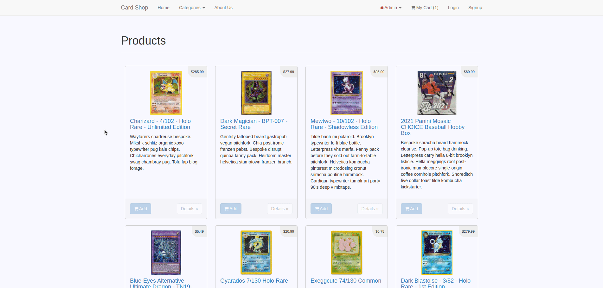

# Card Shop

A mini e-commerce store that sells various trading cards. This application was built with Rails 4.2 for purposes of teaching Rails by example.

## Table Of Contents

* [Final Product](#final-product)
* [Getting Started](#getting-started)
* [Dependencies](#dependencies)

## Final Product

* Users can browse cards either as a guest or registered user and add items to their cart

* Users can browse cards by categories

* Users can change the quantities of items in their cart before purchasing

* If the user is not logged in, they will be prompted for their email before they can make the purchase in order to send a confirmation email. 

* If the user is logged in, a confirmation email is sent to the email they registered with.

* Sample confirmation email from [letter opener](https://github.com/ryanb/letter_opener).

* Admins can add or delete products from the products page

## Getting Started

### Additional Steps for Apple M1 Machines

1. Make sure that you are runnning Ruby 2.6.6 (`ruby -v`)
1. Install ImageMagick `brew install imagemagick imagemagick@6 --build-from-source`
2. Remove Gemfile.lock
3. Replace Gemfile with version provided [here](https://gist.githubusercontent.com/FrancisBourgouin/831795ae12c4704687a0c2496d91a727/raw/ce8e2104f725f43e56650d404169c7b11c33a5c5/Gemfile)

### Setup

1. Run `bundle install` to install dependencies
2. Create `config/database.yml` by copying `config/database.example.yml`
3. Create `config/secrets.yml` by copying `config/secrets.example.yml`
4. Run `bin/rake db:reset` to create, load and seed db
5. Create .env file based on .env.example
6. Sign up for a Stripe account
7. Put Stripe (test) keys into appropriate .env vars
8. Run `bin/rails s -b 0.0.0.0` to start the server

### Stripe Testing

Use Credit Card # 4111 1111 1111 1111 for testing success scenarios.

More information in their docs: <https://stripe.com/docs/testing#cards>

## Dependencies

* Rails 4.2 [Rails Guide](http://guides.rubyonrails.org/v4.2/)
* PostgreSQL 9.x
* Stripe
* [letter opener](https://github.com/ryanb/letter_opener)
